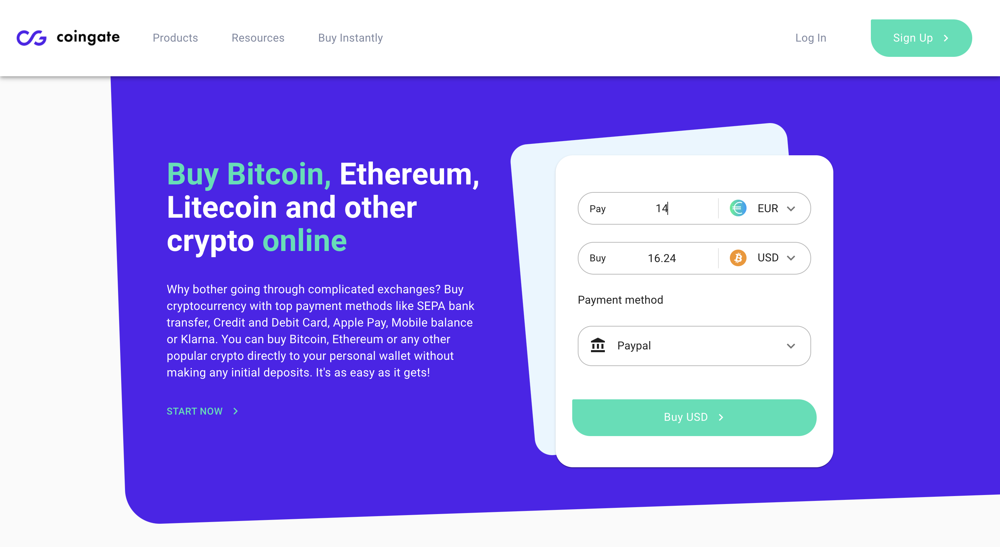

# A Preview:

 

# About the task:
Hello and thanks for checking my work 👋👋👋
 

This project was built with create-next-app, Recommended browser: <strong>Chrome</strong>
 
Recommended resolutions:
<strong>1440 x 729</strong> (laptop devices)
<strong>375 x 812</strong> (Mobile devices or IphoneX)

Visit the app at: https://coingate.vercel.app/

# Technologies used

 <ul>
  <li><strong>TypeScript</strong></li>
  <li><strong>React.js - Next.js</strong></li>
  <li><strong>Material UI</strong></li>
  <li><strong>User-Interface implemented Desktop first</strong></li>
 </ul>

 

# Patch v1.0 notes

<ul>
  <li>A layout component created for header, sidedrawer and potentially other elements</li>
  <li>The home page contains currency converter where user is able to change currencies using a dropdown </li>
  <li>The "Start now" link will redirect you to another page as well as the CTA.</li>
  <li>3 payment methods added as required.</li>
  <li>Responsive design: ideally the app works best on laptop screens 1440 x 729 and mobile devices 375 x 600 as required on Figma</li>
 </ul>
  

# Patch v1.1 notes

<ul>
  <li>BTC is now pre-selected as required</li>
  <li>Fixed some logical errors in the calculator component</li>
  <li>For the sake of simplicity,all hard-coded data were exported to a sperate file (data.tsx)</li>
 </ul>
  

## Similar tasks:

<strong>To-Do App with React.ts </strong> https://github.com/AhmadBitarV/teso-2021  
<strong>Pointer boardgame with React.ts</strong> https://github.com/AhmadBitarV/teso-2020 
  
 

## Links

<strong>My LinkedIn</strong> https://www.linkedin.com/in/ahmedbitar/ 

