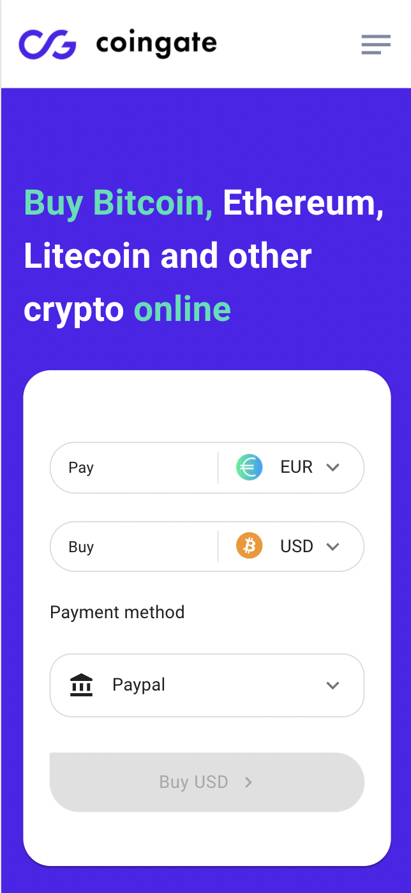

# A Preview:

 

# Technologies used

This project was built with create-next-app
recommended browser: Chrome

 <ul>
  <li><strong>TypeScript</strong></li>
  <li><strong>React.js - Next.js</strong></li>
  <li><strong>Material UI</strong></li>
  <li><strong>UI Desktop first</strong></li>
 </ul>

 

# Patch v1.1 notes

<ul>
  <li>A layout component created for header, sidedrawer and potentially other elements</li>
  <li>The home page contains currency converter where user is able to change currencies using a dropdown </li>
  <li>The "Start now" link will redirect you to another page as well as the CTA.</li>
  <li>3 payment methods added as required.</li>
  <li>Responsive design: ideally the app works best on laptop screens 1440 x 729 and mobile devices 375 x 600 as required on Figma</li>

 </ul>
  

## Check out some of other exams

<ul>
  <li><strong>Teso 2021</strong> https://github.com/AhmadBitarV/teso-2021   <li>

<li><strong>Teso 2020</strong> https://github.com/AhmadBitarV/teso-2020  
 </li>

 </ul>
  

 

## Links

<strong>My LinkedIn</strong> https://www.linkedin.com/in/ahmedbitar/ 
